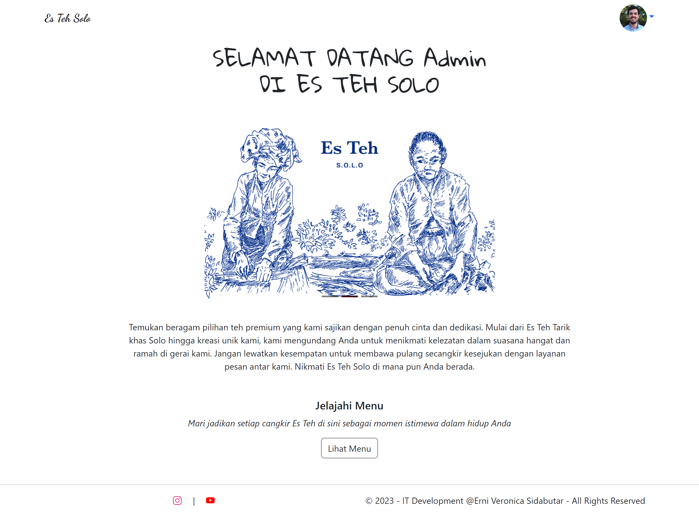
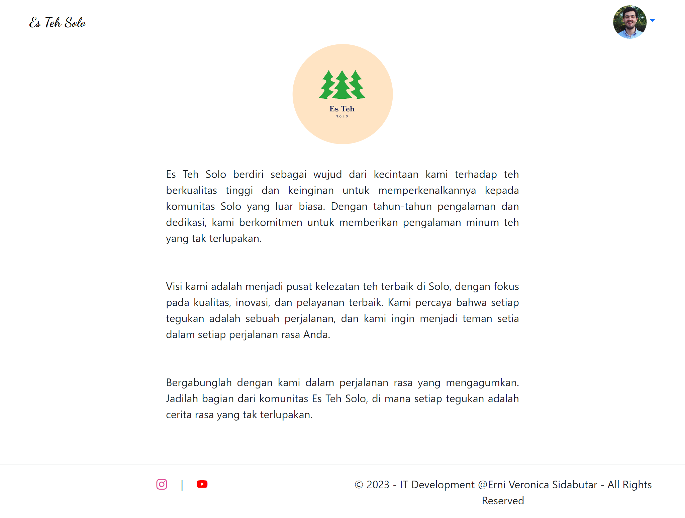
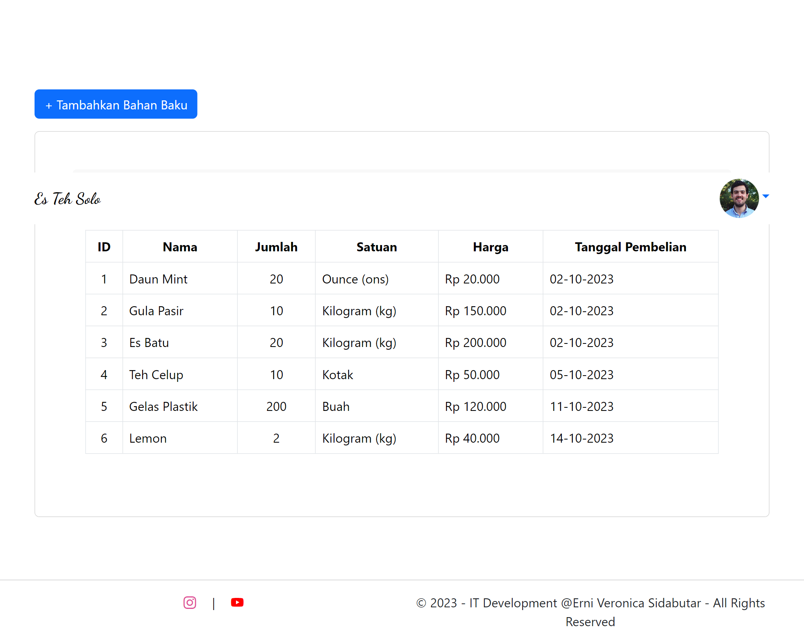
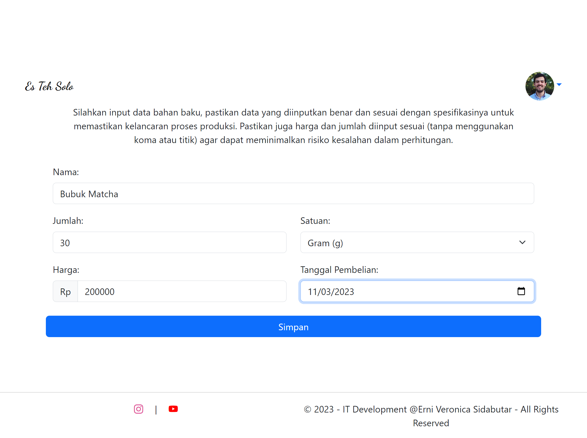
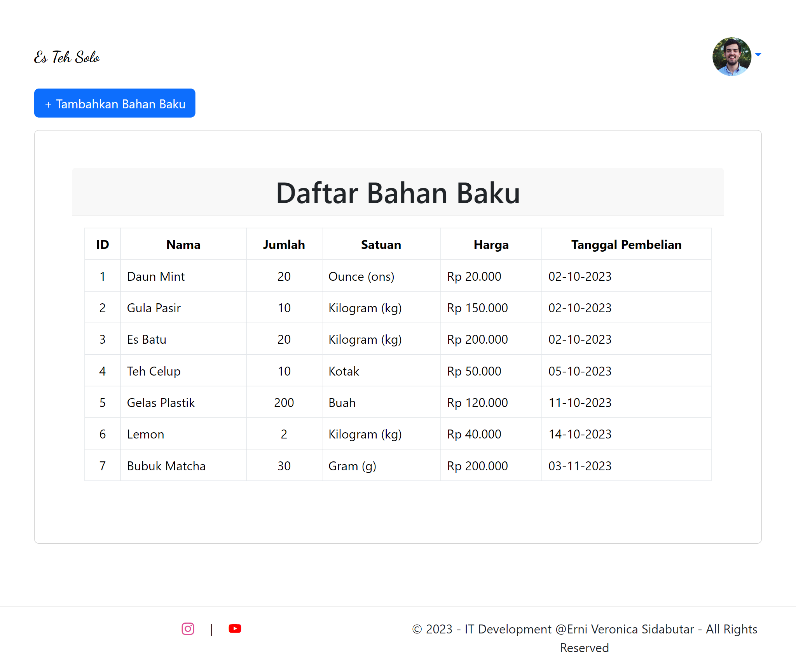
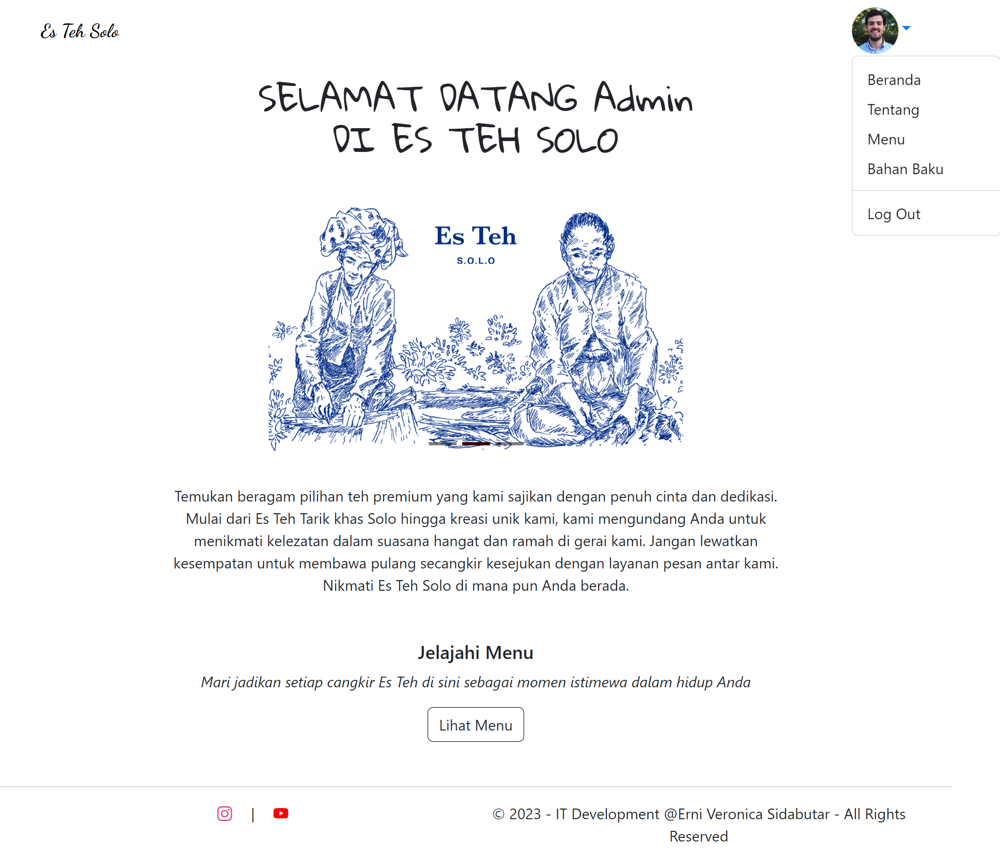
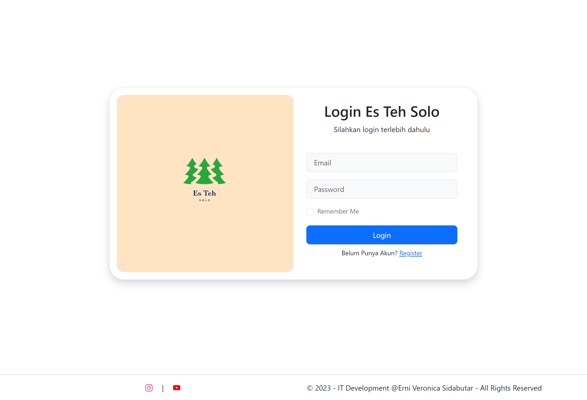

## PROJECT  TITLE : ES TEH SOLO
Alasan saya memilih Es Teh Solo, dikarena saya terinspirasi dengan penjualan Es Teh Solo yang ada di depan kampus dan saya tertarik untuk membuat website Es Teh Solo. Selain itu, industri penjualan teh ini memiliki inovasi dan potensi pasar yang besar.

#### DEMO

##### BAGIAN USER

Pada saat user membuka website Es Teh Solo akan muncul tampilan awal yaitu selamat datang (beranda) yang dilengkapi dengan 4 navbar yaitu:

**1. Beranda**

- Pada tampilan awal (beranda) terdapat tampilan selamat datang dengan tampilan gambar yang berkaitan dengan Es Teh Solo, dan jelajahi menu. Apabila bagian jelajahi menu diklik maka akan mengakses halaman menu Es Teh Solo.
  

**2. Tentang**

- Pada tampilan tentang terdapat gambar logo, sejarah singkat, dan visi dari Es Teh Solo.

**3. Menu**

- Pada tampilan menu terdapat menu yang tersedia pada Es Teh Solo yang dilengkapi dengan gambar dan deskripsi pada setiap menu yang ada.

**3. Ulasan**

- Pada tampilan ulasan terdapat ulasan dari pengguna tentang Es Teh Solo yang berisikan dengan nama, rating (bintang), dan ulasan dari pengguna ataupun penikmat es teh solo.  

- Selain itu, terdapat button tambah ulasan dimana setiap pengguna ataupun penikmat es teh solo dapat menambahkan (menginputkan) ulasan berdasarkan opini masing-masing.

- Apabila pengguna selesai menambahkan (menginputkan) ulasan, kemudian mengklik button kirim ulasan akan muncul tampilan ulasan dari pengguna yang telah diinputkan pada bagian ulasan.

  

##### BAGIAN ADMIN

Untuk mengakses bagian admin dapat menggunakan /admin

Pada saat admin membuka website Es Teh Solo akan muncul tampilan login, dimana untuk dapat mengakses halaman admin harus login terlebih dahulu. Saat ingin login admin harus memiliki akun terlebih dahulu, apabila admin belum memiliki akun, admin dapat mendaftar akun terlebih dahulu dengan klik bagian register.

**Register**
Pada tampilan register, admin akan diminta untuk memasukan nama, email, password, dan konfirmasai password untuk pembuatan akun.

Setelah melakukan daftar akun, admin dapat melakukan login menggunakan akun yang telah didaftarkan dengan memasukan email dan password.

**Login**

Apabila admin berhasil login sesuai dengan akun yang telah didaftarkan maka akan muncul tampilan website Es Teh Solo bagian admin, yang berisikan tampilan awal yaitu selamat datang (beranda) yang dilengkapi dengan 5 menu pilihan yaitu:

**1. Beranda**

- Pada tampilan awal (beranda) terdapat tampilan selamat datang dengan tampilan gambar yang berkaitan dengan Es Teh Solo, dan jelajahi menu. Apabila bagian jelajahi menu diklik maka akan mengakses halaman menu Es Teh Solo.

**2. Tentang**

- Pada tampilan tentang terdapat gambar logo, sejarah singkat, dan visi dari Es Teh Solo.

**3. Menu**

- Pada tampilan menu terdapat menu yang tersedia pada Es Teh Solo yang dilengkapi dengan gambar dan deskripsi pada setiap menu yang ada.

**4. Bahan Baku**

- Pada tampilan bahan baku terdapat daftar bahan baku yang berisikan dengan tabel id, nama, jumlah, satuan, harga dan tanggal pembelian.

- Selain itu, terdapat button tambahkan bahan baku dimana admin dapat memenambahkan (menginputkan) bahan baku yang telah dibeli untuk mengetahui bahan baku apa saja yang telah dibeli.

- Apabila admin selesai menambahkan (menginputkan) bahan baku, kemudian mengklik button simpan akan muncul tampilan bahan baku yang telah diinputkan pada bagian daftar bahan baku.
  

**5. Logout**
Untuk keluar dari sistem, admin dapat melakukan logout. Setelah logout maka akan muncul tampilan login.

   

  
  
<i>2109116029 / Erni Veronica Sidabutar / SI A</i>
